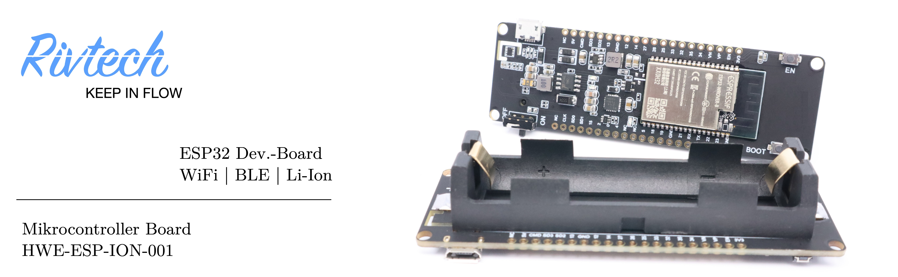

# HWE-ESP-ION-001

Mit diesem IoT Entwicklungsboard heben Sie Ihre Projekte auf das nächste Level. Brechen Sie die Ketten einer ortsgebundenen Stromversorgung und erleben Sie ganz neue Designfreiheiten mit einem batteriebetriebenen Dev.-Board. 

Das sowohl leistungsstarke als auch energiesparende Herz dieser Hauptplatine ist ein integrierter **ESP32-Dual-Core Prozessor**.  Durch die hohe Kompatibilität des Mikrocontrollers können Sie die Systemarchitektur Ihres Projekts auf einer etablierten Plattform wie **MicroPython** oder **Arduino** aufbauen und dadurch Ihr vorankommen massiv beschleunigen. Die flexible und reibungslose Überführung in **mobile Anwendungen** wird dabei durch den auf der PCB-Rückseite montierten **18650 Li-Ion** Akku-Halter ermöglicht. So kombinieren Sie die Vorteile von plattformbasiertem Rapid Prototyping mit Akku getriebenen **IoT**-Entwicklungsansätzen. 
